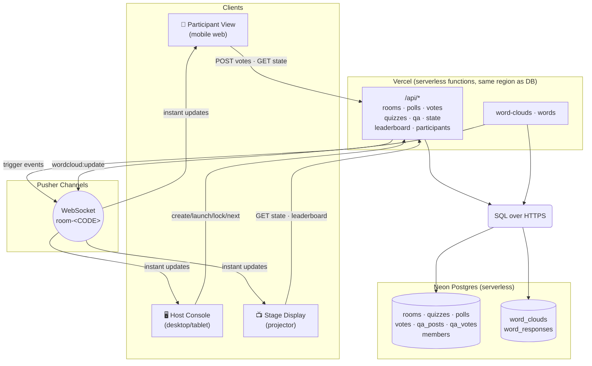
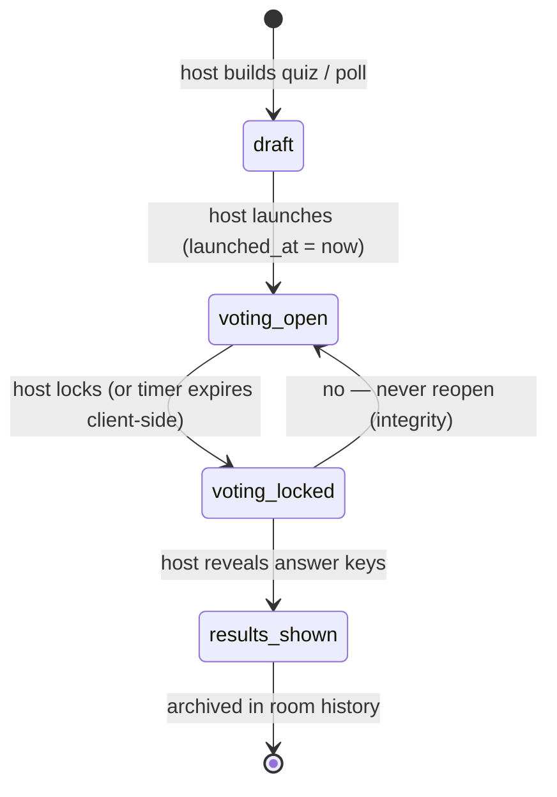
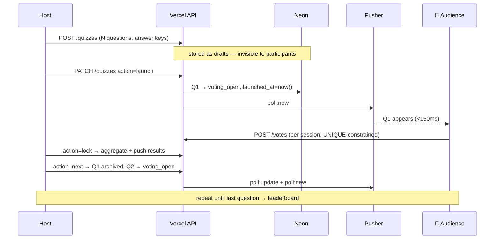
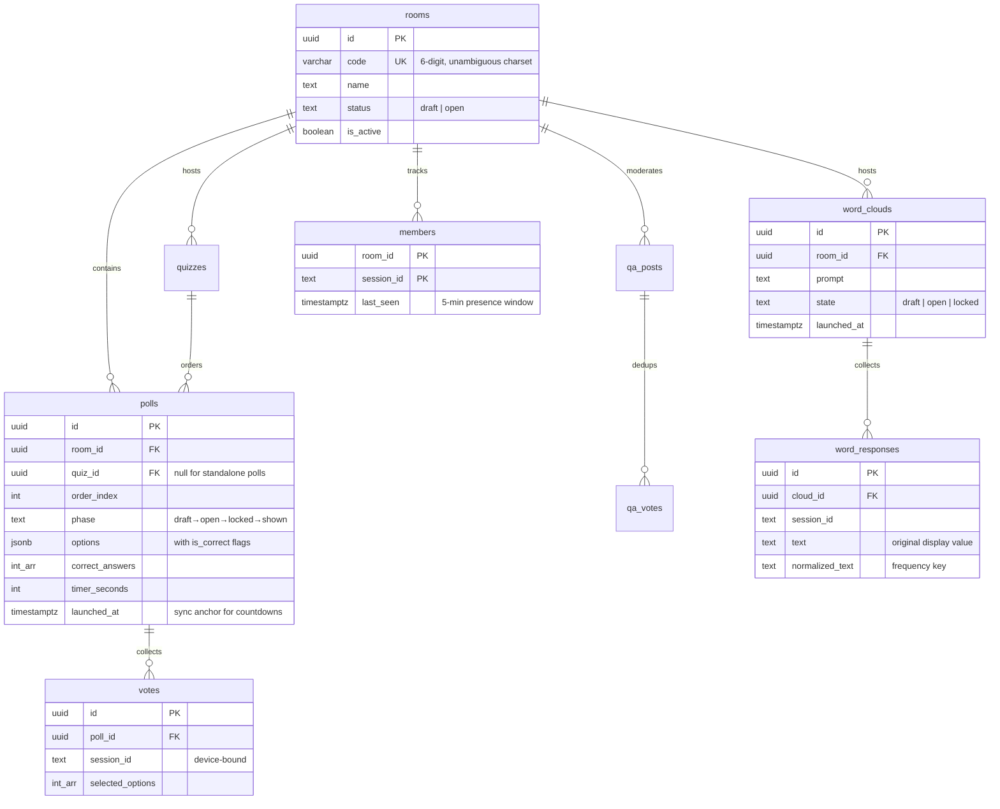

<div align="center">

# ⚡ Engage

[](https://github.com/Cyberheathens/Quizzer/actions/workflows/ci.yml)
[](LICENSE)

**Real-time audience engagement platform** — live polls, sequential quizzes, Q&A walls, word clouds.

*Zero signups. Scan a QR. Engage.*

**Built by [Cyberheathens](https://github.com/Cyberheathens)** — IISER Bhopal Coding Club
*"Build. Break. Learn. Repeat."*

</div>

---

## Why this exists

Presentations are one-directional. Someone talks, 400 people listen, and the only
interaction is a raised hand. **Engage** flips the room: every phone becomes a
voting device, a question channel, and a live data source — with no app install,
no account, no friction.

| PRD Metric | Target | What we ship |
|---|---|---|
| Real-time sync latency | < 150 ms | Pusher WebSocket + REST fallback |
| Time to participate | < 3 s | QR scan → vote in ~2 taps |
| Room scale | 1000 concurrent | ~170 on pure free-tier REST, 1000+ with Pusher slots |
| Poll completion rate | > 80 % | Three-phase flow kills peer bias |

---

## Features

- **Frictionless entry** — the QR-visible 6-character room code is also the room password; zero signup
- **Live polling** — single choice, multi-select, **multi-correct answer keys**, timed countdowns
- **Sequential quizzes** — build N-question quizzes as drafts, launch Q1, then *you* control the pace: Lock → Reveal → Next
- **Live leaderboard** — auto-scored against answer keys, streaming on stage
- **Q&A wall** — upvoting (one vote per person, toggleable), moderation queue, pin / answering / answered / hide
- **Moderated word clouds** — dedicated prompts, draft/live/locked states, server-side normalization, duplicate and profanity protection, realtime frequency aggregation
- **Stable cloud layout** — deterministic collision-aware placement on participant, host, and projector views
- **Three view modes** — Participant (mobile), Host Console, Stage Display (projector)
- **Draft everything** — rooms and quizzes start closed; edit, then open when the audience walks in

---

## Architecture



**The one design decision that matters:** Vercel functions are stateless and
WebSocket-hostile, so *the database is the source of truth* and Pusher is only a
fan-out optimization. Every client also runs a **state-sync loop** — if Pusher
works they get sub-150ms updates; if it doesn't (free tier caps connections,
corporate firewalls), the REST loop covers them automatically.

### Poll lifecycle (a finite state machine)



Results are **never** computable during `voting_open` — that's the anti-bias
guarantee. Vote counts only aggregate on lock.

### Quiz flow (host-driven, fully manual pacing)



### Data model



---

## The performance story (real numbers, not vibes)

### DB stress test — Neon free tier (0.25 CU), mixed workload

30% room reads · 20% poll reads · 25% vote inserts + aggregation · 15% upvote races · 10% Q&A posts.
**~5,300 queries fired, zero errors at every level.**

| Concurrency | Throughput | p50 | p95 | p99 |
|---:|---:|---:|---:|---:|
| 1 | 3 req/s | 306 ms | 337 ms | 410 ms |
| 10 | 26 req/s | 308 ms | 846 ms | 936 ms |
| 50 | 82 req/s | 278 ms | 1,216 ms | 4,344 ms |
| 100 | 153 req/s | 371 ms | 1,990 ms | 2,182 ms |
| **200** | **213 req/s ← ceiling** | 605 ms | 1,959 ms | 2,417 ms |
| 400 | 193 req/s (queued) | 1,281 ms | 3,662 ms | 4,365 ms |

> p50 ≈ 300 ms is campus-network RTT to `us-east-1`, not DB time. Vercel
> functions run in the same region as Neon — production p50 drops to single-digit ms.

### 400-participant room simulation (full API path, live DB + Pusher)

| Phase | Volume | Result |
|---|---|---|
| Joins (20/s QR-scan ramp) | 400 | 0 errors |
| Votes (30s surge) | 400 | 0 errors, p50 0.9 s |
| Host lock + aggregate | 1 | 2.4 s |
| Simultaneous reveal (100 clients) | 100 | 0 errors, p99 8.7 s (worst case, campus RTT) |

### The scale math (do this before every real-time project)

```
ceiling            ≈ 213 queries/s          (measured, free tier)
per-participant    ≈ 3 queries / 30 s       (adaptive heartbeat = 1 CTE query
                                             + poll/qa fetch, merged)
sustained capacity ≈ 213 ÷ 0.1 ≈ 1000+ users on REST alone
vote burst         = 1,000 votes / 10 s = 100 writes/s (1 query per vote)
                                            → comfortably under ceiling
```

Three tricks that bought the headroom:

1. **Single-query state endpoint** — heartbeat + presence count + polls + Q&A in
   one CTE round-trip instead of 4 separate requests per client tick
2. **Adaptive intervals** — server watches room size and tells clients to back
   off: `>150 participants → 30 s`, open question → `5 s`, else `2.5 s`
3. **Slim vote path** — INSERT only (1 query); results aggregate once on lock,
   never per-vote

---

## 🎓 How to design a system like this from scratch

<details>
<summary><b>Step 1 — Write the KPIs before the code</b></summary>

"Real-time" is meaningless without numbers. Ours came straight from the PRD:
**<150 ms sync**, **<3 s to first vote**, **1000 concurrent**. Every later
argument ("do we need Redis?", "is 5s polling ok?") resolves against these. When
Pusher's free tier capped WebSocket connections at 100, the KPI table said the
REST fallback at 5s still satisfied *time-to-participate*, so we shipped without
panic-refactoring.

</details>

<details>
<summary><b>Step 2 — Model the data first, endpoints second</b></summary>

Every feature is a table constraint:

- **One vote per person** → `UNIQUE(poll_id, session_id)` — the DB rejects
  duplicates, the API just maps that to a 409
- **One upvote per person** → `PRIMARY KEY (post_id, session_id)` on `qa_votes`
- **Quiz ordering** → `order_index` + `quizzes.active_index` — "next question"
  is an index increment, not a guess
- **Presence** → upsert `last_seen` + a 5-minute window count; no heartbeats to
  a separate presence server

If a feature can't be expressed as a constraint, it's probably a cron job in disguise.

</details>

<details>
<summary><b>Step 3 — Pick the boring real-time architecture</b></summary>

The textbook answer is "WebSockets". The honest answer for 2026 serverless:

1. **DB is truth.** All reads go through one state endpoint. Pusher events are
   *hints* that make clients update sooner — they never carry state the DB
   doesn't confirm on next sync.
2. **Fan-out is rented, not built.** Redis pub/sub clusters are great until you
   are debugging them at 1 AM before a college event. Pusher free tier covers
   the first 100 sockets — exactly the host console + stage, the screens that
   actually need instant updates.
3. **Make the fallback automatic.** Clients don't "detect failure and switch" —
   they *always* run the REST loop; Pusher just makes it faster. Failure modes
   you don't have to detect can't fail to trigger.

</details>

<details>
<summary><b>Step 4 — Count your queries per user per second</b></summary>

This is the entire capacity-planning exercise:

```
naive design:  polls + qa + heartbeat(2 queries) per 2.5s = 1.6 q/s/user
               → free tier dies at ~130 users

shipped design: 1 merged CTE query per adaptive interval (30s under load)
               → 0.1 q/s/user → 1000+ users
```

The merge used one Postgres CTE with `INSERT ... ON CONFLICT ... RETURNING` and
`json_agg` — a single round-trip doing the work of four. Under load the server
*pushes the interval to clients* rather than queuing requests it can't serve.

</details>

<details>
<summary><b>Step 5 — Design the anti-fraud / anti-chaos layer</b></summary>

- **Vote integrity**: session IDs in `localStorage` (not cookies → no auth
  friction), uniqueness enforced in SQL, votes on non-open polls rejected 403
- **Peer-bias elimination**: results hidden during `voting_open`, computed only
  on lock — audience can't bandwagon
- **Timer integrity**: countdowns anchored to server-side `launched_at`, not
  device clocks — everyone sees the same clock regardless of when they loaded
- **Abuse caps**: Q&A capped at 300 chars, upvote dedup at the DB, profanity
  slots into the moderation queue pre-render

</details>

<details>
<summary><b>Step 6 — Load test the real workload, not hello-world</b></summary>

Our stress script mixes reads/writes in app-realistic proportions, ramps joins
at QR-scan speed (~20/s), and simulates the *reveal stampede* (everyone staring
at results). Three things we learned that hello-world benchmarks would never show:

1. **Neon cold starts** (scale-to-zero) cost 1–6 s on the first query → we built
   `npm run prewarm` into the event runbook
2. **Cross joins with empty CTEs return zero rows** — our presence-count CTE
   silently nuked the whole state query when no quiz was active. Found by
   simulation, not by reading docs
3. **IPv6 ≠ IPv4 on campus networks** — Node fetch happily timed out on
   unreachable IPv6 while `curl` worked fine; forced IPv4 DNS in dev

</details>

<details>
<summary><b>Step 7 — Expect deployment runtime differences (and test for them)</b></summary>

The same repo ran locally but crashed on Vercel — three separate times:

1. TypeScript in `api/` worked locally, Vercel emitted ESM with extensionless
   relative imports → `ERR_MODULE_NOT_FOUND`
2. Converted to CJS, but `"type": "module"` in package.json made Vercel treat
   `.js` as ESM → `require is not defined`
3. Final shape: **functions as ESM `.js` importing `.cjs` helpers with explicit
   extensions** — and `.cjs`-only files aren't detected as Vercel functions at all

Plus the classic: two copies of the same logic (local dev server + serverless
functions) drift apart, and the bug exists only in prod. Lesson: **one source of
truth per code path**, and always smoke-test the deployed artifact.

</details>

---

## Run it

Requirements: Node.js 20+, npm, a Neon Postgres database, and optional Pusher
credentials for instant updates. REST synchronization still works without Pusher.

```bash
git clone https://github.com/Cyberheathens/Quizzer.git
cd Quizzer
npm ci

cp .env.example .env   # fill in Neon + Pusher credentials (below)
npm run db:init        # create all tables
npm run dev:all        # API on :3001 and UI on :5173
```

### Event-day runbook

```bash
npm run prewarm        # wake Neon (cold start = 1-6s), verify schema + Pusher
npm run simulate-room  # dress rehearsal: 400 fake participants through the full flow
```

### Deploy (Vercel + Neon + Pusher — all have free tiers)

| Provider | You get | Env vars |
|---|---|---|
| [Neon](https://neon.tech) | Serverless Postgres | `DATABASE_URL` |
| [Pusher](https://pusher.com) | WebSocket fan-out | `PUSHER_APP_ID` `PUSHER_KEY` `PUSHER_SECRET` `PUSHER_CLUSTER` `VITE_PUSHER_KEY` `VITE_PUSHER_CLUSTER` |
| [Vercel](https://vercel.com) | Functions + hosting | — (reads the above) |

Set them for **Production + Preview**, deploy, done: `vercel --prod`

### Verification

The default suite is credential-free and is the same command run by CI:

```bash
npm run verify
```

It runs Oxlint, Node's built-in unit tests, syntax checks for server files, and a
production Vite build. Database stress and room simulations are opt-in because
they create temporary records and require configured services:

```bash
npm run stress-db
npm run simulate-room -- 400
```

GitHub Actions runs verification on every pull request and every push to `main`.

### Contributing and license

Read [CONTRIBUTING.md](CONTRIBUTING.md) before opening a pull request. Engage is
open-source software provided under the [MIT License](LICENSE).

---

## Tech stack

**Frontend** React 19 · TypeScript · TailwindCSS 4 · Framer Motion · Recharts · Zustand · qrcode.react
**Backend** Vercel serverless functions · Neon serverless Postgres (SQL-over-HTTPS) · Pusher Channels
**Testing** Node test runner · Oxlint · syntax checks · Vite production build · workload simulator · GitHub Actions

## Project structure

```
api/            # serverless functions (ESM .js + .cjs helpers)
  _db.cjs       # shared database schema
  _pusher.cjs   # realtime wrapper with graceful REST fallback
  state.js      # single-query client sync (the performance-critical path)
  quizzes.js    # sequential quiz engine (launch/lock/reveal/next)
  word-clouds.js# host lifecycle: draft, launch, lock, delete
  words.js      # participant submission and aggregate snapshots
  leaderboard.js
src/
  pages/        # Landing · CreateRoom · Room (routes to the 3 views)
  components/
    participant/# voting card w/ countdown and Q&A
    presenter/  # host console: poll + quiz builders and moderation
    stage/      # projector view: charts, QR, leaderboard, question stream
    wordcloud/  # host, participant, and collision-aware display components
tests/          # credential-free Node unit tests
.github/        # pull-request and main-branch CI
scripts/        # prewarm · init-db · stress-db · simulate-room
```

## Roadmap

- [ ] v1.1 — SAML/SSO, white-label branding (PRD P2)
- [ ] Per-device vote fingerprinting (canvas/WebGL)
- [ ] Q&A sentiment/toxicity scoring
- [ ] Quiz question pools (randomize per participant)

---

<div align="center">

**MIT License** · Made by **Cyberheathens** — IISER Bhopal

*If this taught you something about system design, star the repo and build the next one.*

</div>
